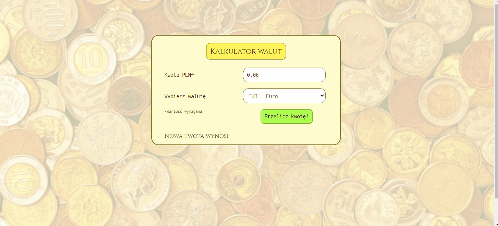

#  Currency Converter Website

 Made by Klaudia Kępka

##  Currency Converter Demo Website:
[Currency Converter Demo Website](https://kepkaklaudia.github.io/currencyConverter/)

##  Quick Preview

## First field
In the first field, you can enter the amount in PLN that you want to convert to another currency. You can enter the amount using the keyboard or use the arrows hidden in the right part of the field. The accuracy is 0.01.

## Second field
Here you can choose the currency to which you want to convert your PLN amount. You can choose EUR, USD, GBP or CHF.

## "Przelicz kwotę!" button
There is a special button below the fields. When you click it, the converter can do the calculations.

## Results
When you click "Przelicz kwotę!" button, you will see your amount in the new currency after the words "Nowa kwota wynosi:"

## Responsive version
When you are in mobile mode (maximum width of screen: 600px) you can notice some changes. 
The box is slightly smaller and the fields are arranged in one column to fit on mobile screens.

## Technologies used
     